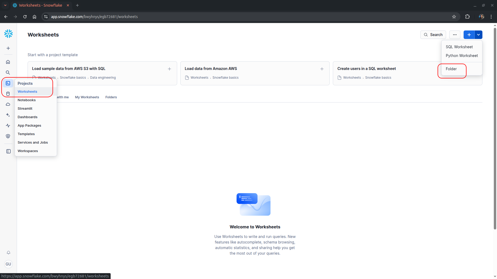
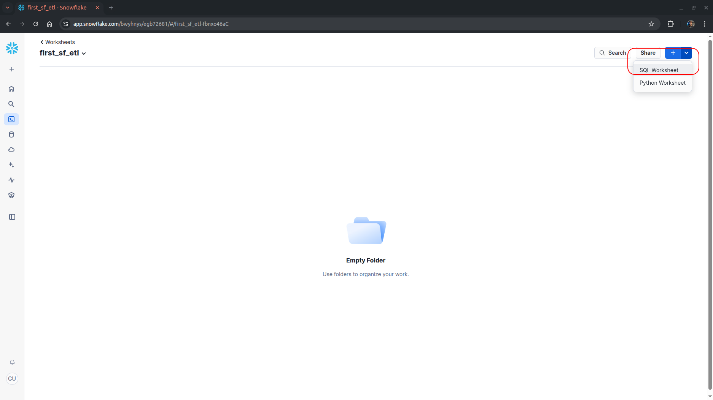
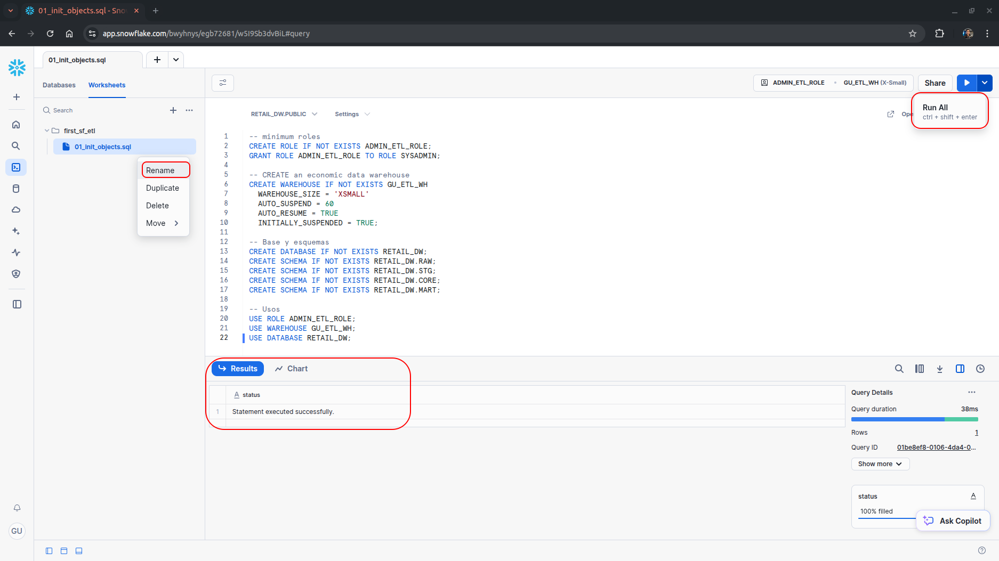
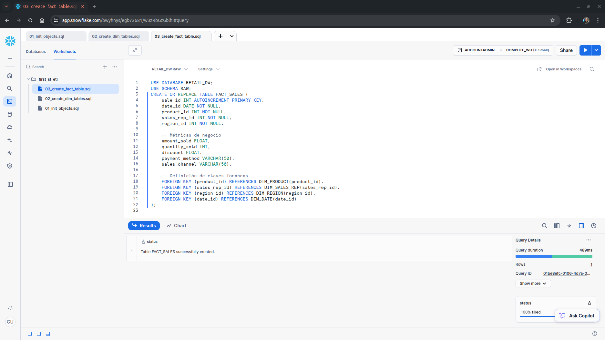
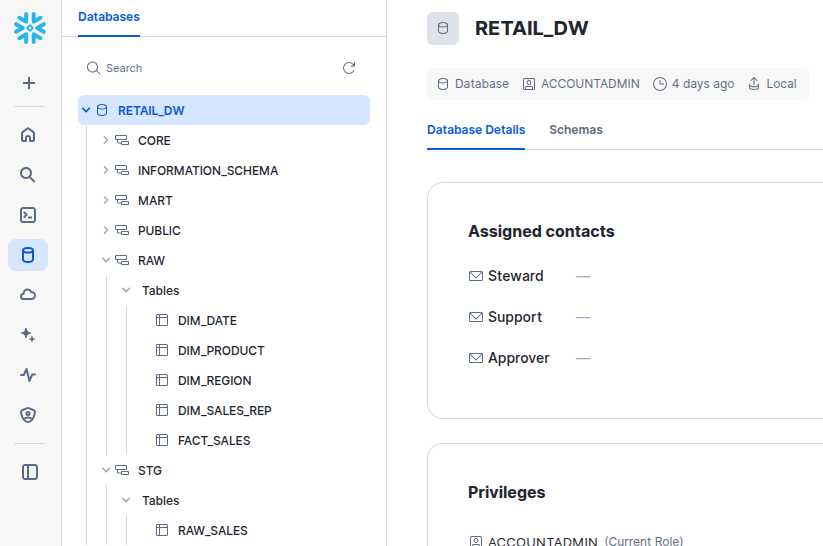
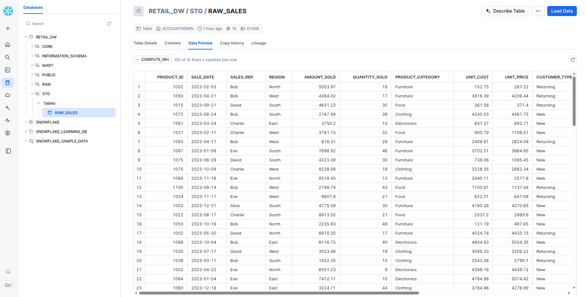
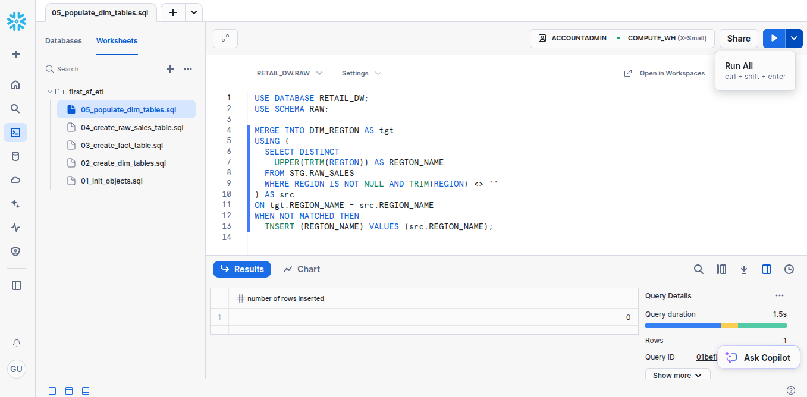
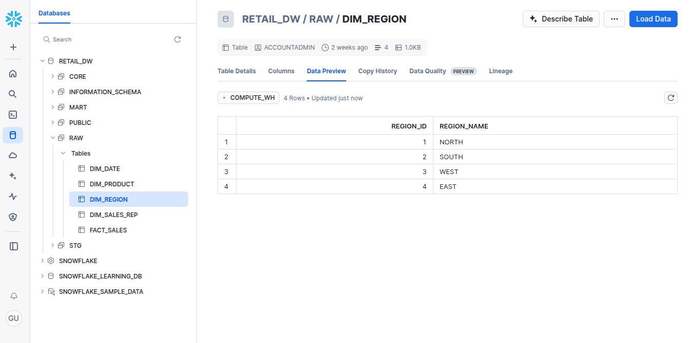

# retail-snowflake-etl

Desde la página principal de **Snowsight**, vamos a crear una nueva carpeta para mantener el proyecto organizado. Le vamos a dar el nombre de *first_sf_etl*


Dentro de nuestra carpeta de proyecto vamos a crear un nuevo `SQL Worksheet`.


Pegar el contenido del archivo `sql/01_init_objects.sql`. Aquí podemos renombrar los worksheets y luego ejecutamos todas las sentencias SQL. Abajo en "status" vemos que se ejecutó sin problemas.


Repetimos el proceso para los archivos `sql/02_create_dim_tables.sql` , `sql/03_create_fact_table.sql` y `sql/04_create_raw_sales_table.sql`


Si ingresamos desde el panel a **Databases** podemos observar nuestro trabajo hasta ahora.


Ahora procedemos a realizar la carga de datos crudos almacenados en el archivo **input_data/sales_data.cvs**. Para esto procedemos a realizar un *proceso ETL con python*.
Debemos correr el script: ```python3 load.py ``` desde el directorio **src/**. Los datos crudos se almacenarán en el esquema **"STG"** en la tabla **"RAW_SALES"** dentro de *Snowflake*.

Podemos ver los resultados:


Con los datos crudos ya cargados, vamos a proceder a poblar las tablas de dimensiones creadas en pasos previos. Deberás dirigirte a nuestra carpeta de proyecto que llamamos **first_sf_etl** y pegar el contenido del archivo `sql/05_populate_dim_tables.sql`.

Luego ejecutar la sentencia SQL.


Podemos ver los resultados, por ejemplo para la tabla *DIM_REGION*.


